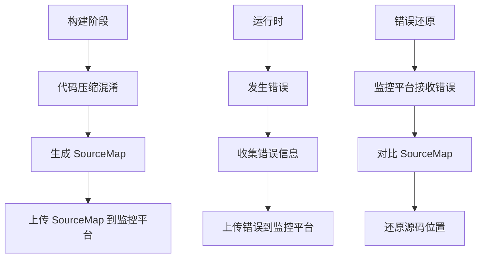
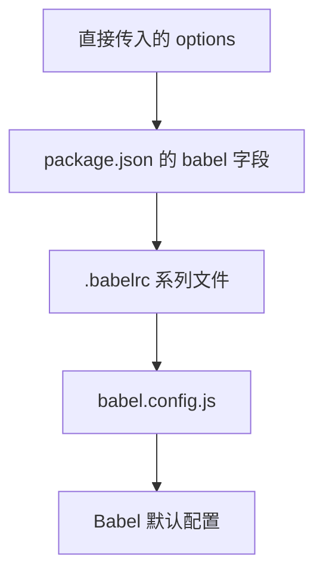

# learn_babel

## 生产环境下 sourceMap 的工作方式

在生产环境下打包时，会生成 sourceMap 并上传至服务端，但是不会暴露给用户，在用户使用时发生异常后，也会将异常上传至服务端，服务端通过上传的信息对比 sourceMap 来定位发生错误的代码所在文件及行列信息

### 生产环境 SourceMap 工作流程



### 具体流程示例：

1. **构建阶段**：
````javascript:webpack.config.js
module.exports = {
  mode: 'production',
  devtool: 'hidden-source-map',
  plugins: [
    new SentryPlugin({
      include: './dist',
      release: 'v1.0.0'
      // SourceMap 会被上传到 Sentry 服务器
    })
  ]
}
````

2. **运行时错误捕获**：
````javascript:error-handler.js
try {
  // 用户操作触发错误
  someFunction();
} catch (error) {
  // 收集错误信息
  const errorInfo = {
    message: error.message,
    stack: error.stack,
    // 压缩后的位置信息
    line: error.line,
    column: error.column,
    filename: 'app.min.js'
  };
  
  // 上传到监控平台
  errorTracker.send(errorInfo);
}
````

3. **服务端还原**：
````javascript:server-side.js
// 监控平台收到错误信息后
async function restoreError(errorInfo) {
  // 1. 找到对应版本的 SourceMap
  const sourceMap = await getSourceMap(errorInfo.filename);
  
  // 2. 使用 source-map 工具还原位置
  const consumer = await new SourceMapConsumer(sourceMap);
  const originalPosition = consumer.originalPositionFor({
    line: errorInfo.line,
    column: errorInfo.column
  });
  
  // 3. 得到源码中的位置
  console.log(originalPosition);
  // {
  //   source: 'src/components/Button.js',
  //   line: 42,
  //   column: 10,
  //   name: 'handleClick'
  // }
}
````

### 关键特点：

1. **安全性**
- SourceMap 文件不会下发到用户端
- 错误信息和源码映射分开处理
- 源码信息只在服务端还原

2. **效率**
- 压缩后的代码保证生产环境性能
- 错误发生时才进行源码映射
- 可以进行批量错误处理

3. **准确性**
- 保留完整的源码映射信息
- 能精确定位到源码的行列位置
- 支持框架和库的错误追踪

这种机制既保证了代码的安全性（源码不会泄露），又能在出现问题时快速定位到具体的错误位置，是一个非常实用的生产环境调试方案。


## babel 与 webpack 的协同工作流程

graph TD
    A[源代码] --> B[Webpack 入口]
    B --> C{遇到 JS 文件}
    C -->|通过 loader 配置| D[babel-loader]
    D --> E[Babel Core]
    E --> F[解析为 AST]
    F --> G[应用 Presets/Plugins]
    G --> H[生成 ES5 代码]
    H --> I[返回 Webpack]
    I --> J[Webpack 继续处理依赖]

## babel 配置的优先级


好的，用户之前询问了Webpack和Babel如何协同工作，以及Babel配置文件的加载机制。现在用户进一步询问Babel转译时应用配置项的优先级，需要详细解释不同配置源的优先级顺序。

首先，用户可能是在实际项目中遇到了配置冲突的问题，或者想优化现有配置结构。需要明确各个配置源的优先级，避免混淆。用户可能对Babel的配置文件查找机制已有基本了解，现在需要更深入的优先级说明。

接下来，需要整理Babel配置的各个来源，并按照优先级从高到低排列。需要涵盖直接传入的options、package.json中的配置、.babelrc文件、babel.config.js以及默认配置。同时，要提到合并策略，比如presets的执行顺序和plugins的顺序。

还要考虑特殊情况，比如overrides和env的影响，以及如何通过API调用显式设置配置。需要举例说明不同配置源的优先级如何应用，可能用代码示例来展示不同场景下的配置合并结果。

用户可能关心在复杂项目结构（如Monorepo）中如何管理配置优先级，或者如何覆盖第三方库的Babel配置。需要提到babelrcRoots配置项，以及如何排除node_modules的配置。

最后，总结最佳实践，帮助用户合理组织配置，避免优先级问题导致的意外行为。可能需要强调测试和调试配置的方法，比如使用BABEL_SHOW_CONFIG_FOR环境变量来查看最终配置。


以下是 Babel 转译时配置项优先级的完整解析（从高到低）：



### 1. 优先级层级详解（从最高到最低）

#### 1.1 直接传入的配置（最高优先级）
```javascript
// webpack.config.js
{
  loader: 'babel-loader',
  options: {
    presets: ['@babel/preset-env'], // 直接配置优先级最高
    plugins: ['babel-plugin-import']
  }
}
```
- **特点**：显式覆盖所有其他配置
- **适用场景**：临时测试、特定文件特殊处理

#### 1.2 package.json 中的 babel 字段
```json
{
  "name": "my-project",
  "babel": {
    "presets": ["@babel/preset-react"]
  }
}
```
- **生效范围**：当前 package 目录
- **查找规则**：仅在被处理文件所在目录的 package.json 中查找

#### 1.3 文件级配置 (.babelrc.*)
```javascript
// .babelrc.js
module.exports = {
  plugins: ['@babel/plugin-proposal-class-properties']
}
```
- **查找路径**：
  ```
  /project
  ├── src/
  │   ├── .babelrc ← 生效
  │   └── component.js
  └── lib/
      └── utils.js ← 不生效
  ```

#### 1.4 项目级配置 (babel.config.js)
```javascript
// babel.config.js
module.exports = {
  presets: ['@babel/preset-env']
}
```
- **特点**：影响整个项目（包括 node_modules 除非排除）
- **合并策略**：与文件级配置深度合并

#### 1.5 Babel 默认配置（最低优先级）
```javascript
// 默认配置等价于
{
  "presets": [],
  "plugins": []
}
```

### 2. 配置合并规则

#### 2.1 Presets 执行顺序
```javascript
// 最终执行顺序：
[file-level-preset-3, file-level-preset-2, file-level-preset-1, 
 project-level-preset-3, project-level-preset-2, project-level-preset-1]
```
- **逆序执行**：后配置的 preset 先执行
- **示例**：
  ```javascript
  // babel.config.js
  presets: ['A', 'B']

  // .babelrc
  presets: ['C', 'D']
  
  // 实际执行顺序：D → C → B → A
  ```

#### 2.2 Plugins 执行顺序
```javascript
// 最终执行顺序：
[project-level-plugin-1, project-level-plugin-2, 
 file-level-plugin-1, file-level-plugin-2]
```
- **顺序执行**：先配置的 plugin 先执行
- **示例**：
  ```javascript
  // babel.config.js
  plugins: ['A', 'B']

  // .babelrc
  plugins: ['C', 'D']
  
  // 实际执行顺序：A → B → C → D
  ```

### 3. 特殊配置项优先级

#### 3.1 overrides 配置
```javascript
// babel.config.js
module.exports = {
  overrides: [{
    test: '**/*.ts',
    presets: ['@babel/preset-typescript'] // 覆盖其他配置
  }]
}
```
- **优先级**：高于普通配置项
- **匹配规则**：基于 minimatch 模式匹配

#### 3.2 env 环境配置
```javascript
module.exports = {
  env: {
    production: {
      plugins: ['transform-remove-console']
    }
  }
}
```
- **触发条件**：`process.env.BABEL_ENV` 或 `process.env.NODE_ENV`
- **优先级**：与同级配置合并，不覆盖上层配置

### 4. 配置继承示例
```javascript
// 项目级配置
// babel.config.js
module.exports = {
  presets: ['A'],
  plugins: ['B']
}

// 文件级配置
// src/.babelrc
{
  "presets": ["C"],
  "plugins": ["D"]
}

// 最终生效配置：
{
  presets: ['C', 'A'], // 注意顺序
  plugins: ['B', 'D']  // 注意顺序
}
```

### 5. 调试技巧
查看最终合并配置：
```bash
# 查看特定文件的最终配置
BABEL_SHOW_CONFIG_FOR=./src/index.js npm run build

# 输出结果示例
{
  "options": {
    "presets": [
      ["@babel/preset-env", {"modules": false}],
      ["@babel/preset-react", {"runtime": "automatic"}]
    ],
    "plugins": [
      ["@babel/plugin-proposal-class-properties", {"loose": true}],
      "babel-plugin-import"
    ],
    "sourceType": "module"
  },
  "fileHandling": "base",
  "configFiles": [
    "/project/babel.config.js",
    "/project/src/.babelrc"
  ]
}
```

### 6. 最佳实践建议
1. **基础配置**：在 `babel.config.js` 中定义全局默认配置
2. **特殊配置**：使用 `.babelrc` 处理目录级特殊需求
3. **环境区分**：优先使用 `env` 配置而非多个配置文件
4. **Monorepo 管理**：
   ```javascript
   // 根目录 babel.config.js
   module.exports = {
     babelrcRoots: [
       '.',
       'packages/*'
     ]
   }
   ```
5. **排除干扰**：
   ```javascript
   // 忽略 node_modules 配置
   module.exports = {
     ignore: [
       'node_modules/**'
     ]
   }
   ```

通过理解这些优先级规则，可以更精准地控制不同环境、不同目录下的转译行为，避免配置冲突和意外覆盖。
