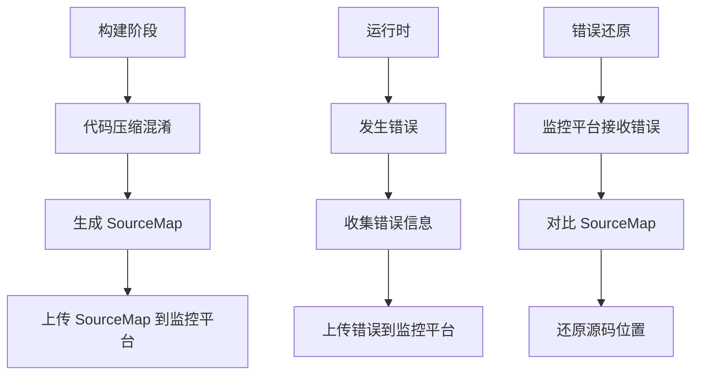

# learn_babel

## 生产环境下 sourceMap 的工作方式

在生产环境下打包时，会生成 sourceMap 并上传至服务端，但是不会暴露给用户，在用户使用时发生异常后，也会将异常上传至服务端，服务端通过上传的信息对比 sourceMap 来定位发生错误的代码所在文件及行列信息

### 生产环境 SourceMap 工作流程



### 具体流程示例：

1. **构建阶段**：
````javascript:webpack.config.js
module.exports = {
  mode: 'production',
  devtool: 'hidden-source-map',
  plugins: [
    new SentryPlugin({
      include: './dist',
      release: 'v1.0.0'
      // SourceMap 会被上传到 Sentry 服务器
    })
  ]
}
````

2. **运行时错误捕获**：
````javascript:error-handler.js
try {
  // 用户操作触发错误
  someFunction();
} catch (error) {
  // 收集错误信息
  const errorInfo = {
    message: error.message,
    stack: error.stack,
    // 压缩后的位置信息
    line: error.line,
    column: error.column,
    filename: 'app.min.js'
  };
  
  // 上传到监控平台
  errorTracker.send(errorInfo);
}
````

3. **服务端还原**：
````javascript:server-side.js
// 监控平台收到错误信息后
async function restoreError(errorInfo) {
  // 1. 找到对应版本的 SourceMap
  const sourceMap = await getSourceMap(errorInfo.filename);
  
  // 2. 使用 source-map 工具还原位置
  const consumer = await new SourceMapConsumer(sourceMap);
  const originalPosition = consumer.originalPositionFor({
    line: errorInfo.line,
    column: errorInfo.column
  });
  
  // 3. 得到源码中的位置
  console.log(originalPosition);
  // {
  //   source: 'src/components/Button.js',
  //   line: 42,
  //   column: 10,
  //   name: 'handleClick'
  // }
}
````

### 关键特点：

1. **安全性**
- SourceMap 文件不会下发到用户端
- 错误信息和源码映射分开处理
- 源码信息只在服务端还原

2. **效率**
- 压缩后的代码保证生产环境性能
- 错误发生时才进行源码映射
- 可以进行批量错误处理

3. **准确性**
- 保留完整的源码映射信息
- 能精确定位到源码的行列位置
- 支持框架和库的错误追踪

这种机制既保证了代码的安全性（源码不会泄露），又能在出现问题时快速定位到具体的错误位置，是一个非常实用的生产环境调试方案。
